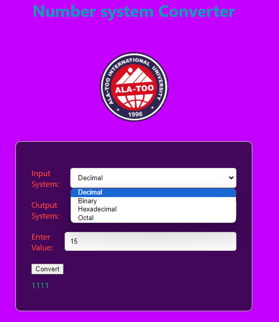
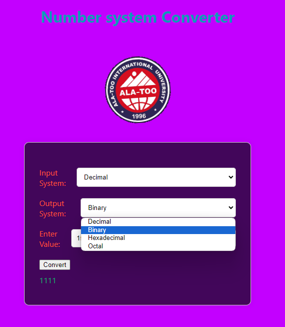
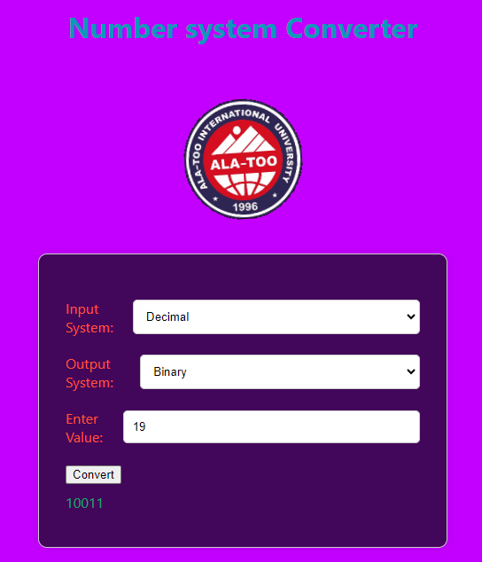

# React Number Converter App Readme

## Overview

The React Number Converter App is a simple yet powerful web application that allows users to convert numbers between different numerical systems, including Decimal, Octal, Binary, and Hexadecimal. This readme file provides essential information about the app, how to set it up, and how to use it.

## Features

- Conversion between Decimal, Octal, Binary, and Hexadecimal numeral systems.
- User-friendly interface with two dropdown bars for selecting the source and target numerical systems.

## Getting Started

To run the React Number Converter App on your local machine, follow these steps:

### Prerequisites

- Node.js and npm (Node Package Manager) should be installed on your system.

### Installation

1. Clone the repository to your local machine:
   ```
   git clone https://github.com/aktan77/Front.git
   ```

2. Install the project dependencies:
   ```
   npm install
   ```

3. Start the development server:
   ```
   npm start
   ```

The app will be running at `http://localhost:3000`. You can open this URL in your web browser to use the React Number Converter.

## Usage

1. Upon opening the app, you will see two dropdown bars, one labeled "Input System" and the other labeled "Output System." These dropdowns allow you to select the source and target numerical systems for conversion.




2. Select the source and target numerical systems from the dropdowns.

3. In the input field, enter the number you want to convert. As you type or make selections, the converted value will be displayed in real-time.

4. Repeat the process to convert more numbers or change the numerical systems as needed.

## Technologies Used

- React: JavaScript library for building user interfaces.
- HTML and CSS: Markup and styling of the application.

## Contributing

Contributions to this project are welcome. If you'd like to enhance or add new features, please follow these steps:

1. Fork the repository.
2. Create a new branch for your feature: `git checkout -b feature-name`.
3. Make your changes and commit them: `git commit -m 'Add a new feature'`.
4. Push your changes to the forked repository: `git push origin feature-name`.
5. Create a Pull Request on the original repository.

## Contact

If you have any questions, suggestions, or issues, feel free to contact the project maintainer at aktan.asankulov@iaau.edu.kg.

Thank you for using the React Number Converter App! We hope it serves your needs effectively.